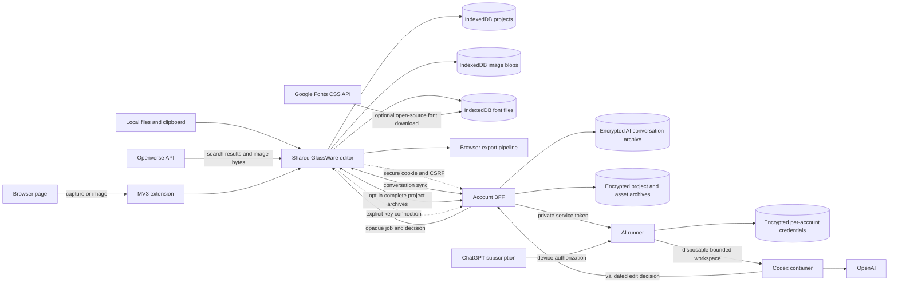
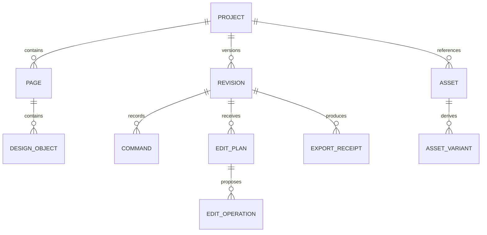

# GlassWare architecture

## Requirements summary

GlassWare is a local-first browser application and MV3 extension for image
composition and photo editing. It must remain useful offline, preserve source
assets locally, support deterministic export, and accept constrained AI edit
plans from several interchangeable providers.

Initial scale is one creator and one device at a time. The architecture favors a
modular client over microservices. Optional cloud modules may be introduced only
for synchronization, model connections, or workloads browsers cannot perform.

## System diagram

## Module boundaries

| Module | Responsibility | Owns data | Exposes |
| --- | --- | --- | --- |
| Project core | Manifest, pages, migrations, commands, revisions, groups, reusable components | Project records | Typed commands and schemas |
| Canvas adapter | Konva node lifecycle and serialization | No durable data | Render and selection adapter |
| Asset repository | Import, blobs, source receipts, thumbnails, relinking | Local asset bytes and attribution | Asset references |
| Image search adapter | Search and download reusable Openverse media | No durable data | Normalized image candidates |
| Export pipeline | PNG/JPEG/WebP/SVG/PDF generation and QA | Export receipts | Export jobs |
| Extension shell | Capture, page integration, clipboard handoff | Pending captures | Chrome messages |
| AI visual agent | Bounded edit/render/inspect/refine orchestration, project conversation history, and one-session undo | Per-account IndexedDB conversation cache, in-memory drafts, and final AI revision | Validated edit decisions |
| Account client | Optional sessions, preferences, safe connection receipts | No credentials | Cookie-backed service contract |
| Account BFF | OIDC session, CSRF, encrypted conversation/project sync, private-runner delegation | Signed session cookie and separate encrypted account conversation and project archives | Narrow account, conversation, project, connection, and job API |
| AI runner | Credential vault, device login, job orchestration | Encrypted credentials and bounded job metadata | Private service API only |
| Codex sandbox | One focused visual step in a bounded resumable thread | Disposable session manifest, attachments, previews, and auth cache | Schema-bound edit decision plus opaque session receipt |

Only project core commits durable project state. Canvas, AI, extension, and
export modules request typed commands rather than mutating persistence directly.

## Domain model

Identifiers are UUIDs, dates are ISO 8601 UTC, dimensions are positive integer
pixels, transformations use an explicit matrix or decomposed numeric fields,
and every plan binds to an immutable base revision.

## Public contracts

- `glassware.project.v1`: engine-independent project state, objects, and
  bounded revision snapshots.
- `glassware.bundle.v1`: portable multi-page project plus base64-encoded local
  image assets, used font assets, and reusable components.
- `glassware.edit-plan.v1`: rationale-bearing proposed object operations.
- `glassware.export-receipt.v1`: source revision, dimensions, MIME type,
  byte size, hash, warnings, and approval time.
- Future MCP tools may wrap the same commands; neither current jobs nor future
  tools receive an unrestricted browser, host filesystem, or canvas mutation primitive.

## Architecture decisions

### ADR-001: Konva as the initial canvas engine

- **Status:** Accepted.
- **Context:** GlassWare needs a typed, MIT object canvas with dependable
  transforms, layers, events, filters, and browser/Node rendering options.
- **Decision:** Use Konva as an adapter behind a GlassWare-owned document
  model. Konva passed the initial Chrome visual alignment check and also powers
  the MIT Filerobot editor. It is not the public project contract.
- **Consequences:** We own serialization, typography behavior, history, and
  migrations. Engine upgrades cannot silently redefine persisted projects.
- **Alternatives:** Fabric has a richer design-document model, but the secure
  7.4 release misaligned rendering and controls in the initial browser proof;
  older versions carried active advisories. miniPaint is broad but monolithic;
  Polotno is commercially licensed.

### ADR-002: one editor build for web and extension

- **Status:** Accepted.
- **Decision:** Package the production web build inside the MV3 extension. The
  extension adds capture and page integration; the editor remains one codebase.
  The store capability profile keeps capture, local editing, persistence,
  account UI, AI chat, and export in the extension origin. The packaged client
  calls the same constrained HTTPS account and AI APIs as the web build.
- **Consequences:** Store packages are larger, but behavior and schemas do not
  drift between surfaces.

### ADR-003: local-first modular client

- **Status:** Accepted.
- **Decision:** Projects and assets live in IndexedDB by default, with OPFS kept
  as a future large-asset migration. No account or backend is required for
  normal editing and compatible export. Authenticated creators may opt into
  account-isolated AES-256-GCM archives containing the complete portable bundle,
  current thumbnail, and conflict metadata. Conversation sync remains a
  separate archive and neither archive accepts credentials or execution handles.
- **Consequences:** Local edits continue while offline. Device loss is mitigated
  only for projects that have completed an opt-in sync or portable backup;
  quotas and conflicts remain visible recovery states rather than silent data
  replacement.

### ADR-004: separate subscription and API connections

- **Status:** Accepted.
- **Decision:** ChatGPT subscription access uses the official Codex CLI device
  flow in a private runner. Direct API use uses a separately billed API key.
  Both credential types are encrypted server-side and used only inside
  per-account disposable Codex workspaces.
- **Consequences:** The UI must explain the distinction and disclose residency
  before a model receives content. The runner requires its own deployment,
  vault key, internal token, Docker boundary, revocation, and audit controls.
  Model and reasoning choices are explicit job inputs validated against a
  runner-owned allowlist before Codex starts.

### ADR-005: non-destructive image edits and presentation in the project model

- **Status:** Accepted.
- **Context:** Photo adjustments must survive reload, undo, portable export,
  canvas-engine upgrades, and future AI edit plans without replacing originals.
- **Decision:** Keep original blobs immutable. Store crop rectangles as normalized
  source coordinates, adjustments as bounded typed values, masks as normalized
  hide/restore brush strokes with feather/inversion, and presentation as
  engine-independent corner, frame, and shadow values on image objects. Canvas
  snapshots also carry a whole-artwork presentation with enablement, outer
  spacing, a solid/gradient/image backdrop, corners, frame, and shadow. Frames
  are engine-independent identifiers for browser, glass, border, and photo
  shells; backdrops retain bounded opacity, blur, and texture values. The editor
  renders that mode as a transformed, clipped composition group while keeping
  every child object's coordinates and editability intact. The
  Screenshot Studio adapter translates the supported `set_border_radius`,
  `set_frame`, and `set_shadow` operation vocabulary into this model. The canvas
  adapter renders these values with Konva filters, composite frame groups, and
  display-sized caches. Screenshot annotations remain ordinary editable shape
  nodes; opaque redaction is intentionally distinct from visual blur. Replacing
  an image updates only its immutable source-asset reference, preserving the
  node's layout and non-destructive settings. Existing v1 image objects migrate to a full crop,
  neutral adjustments, and neutral presentation; the public v1 schema keeps the
  new fields optional for backward compatibility. Project renders are assembled
  on a hidden staging layer and swapped atomically so undo/page switches cannot
  expose or serialize a half-loaded image stack.
- **Consequences:** Image and whole-artwork edits remain reversible and
  engine-independent, and full exports preserve their original dimensions.
  Filter caches
  consume browser memory; complex masks and large sharpen/blur caches require
  bounded display resolution and export capability checks.
- **Alternatives:** Destructive raster replacement was simpler but would lose
  source quality and editability. Persisting Konva filter JSON would couple the
  public contract to one rendering engine.

### ADR-006: optional OAuth account service with legacy-device compatibility

- **Status:** Accepted.
- **Decision:** Keep normal editing accountless. The public client preserves old
  device-profile data for migration but creates no new pseudo-accounts. Sign-in
  uses the shared Wiplash realm through an HTTPS private-service adapter; the
  realm owns Google, GitHub, and GitLab provider selection and can reuse an
  existing Wiplash SSO session. Web sessions remain app-specific HTTP-only
  cookies and mutating web requests use CSRF receipts. The extension uses a
  browser-owned identity window, S256 PKCE, and a revocable app-specific bearer
  session; connection responses contain opaque identifiers rather than
  provider credentials.
- **Consequences:** Old local data remains readable, but device mode does not
  claim cloud authentication and cannot fake sync or provider authorization.
  The extension requests its narrow `auth.wiplash.ai` host permission only when
  the user signs in. Its stored token identifies only a GlassWare account
  session; provider and Keycloak tokens remain server-side. Server records are
  encrypted, keyed by token hashes, restart-safe, expiring, and revocable.

### ADR-007: Openverse adapter for openly licensed image search

- **Status:** Accepted.
- **Context:** The Images tool needs useful web search without embedding a
  commercial stock-provider key or pretending arbitrary web images are safe to
  reuse.
- **Decision:** Use the anonymous Openverse API through a typed client adapter.
  Initial results are limited to PDM, CC0, and CC BY entries with mature results
  disabled. Download through Openverse's CORS-enabled image endpoint, save the
  resulting bytes locally, and persist provider, creator, source URL, license,
  and attribution alongside the asset. The MV3 package requests access only to
  `https://api.openverse.org/*`.
- **Consequences:** Search remains optional and normal editing stays local.
  Openverse rate limits and availability affect search, not saved projects.
  Catalog license information can be inaccurate, so the interface preserves a
  source link and asks users to verify the license before publishing.
- **Alternatives:** Arbitrary search-engine scraping was rejected because it
  lacks a dependable reuse-rights contract. Commercial stock APIs were deferred
  because they add credentials, provider terms, and account coupling.

### ADR-008: Local font catalog with optional Google Fonts download

- **Status:** Accepted.
- **Context:** Text needs a useful free catalog and user font uploads without
  making editing, reload recovery, or project sharing depend on a remote font
  stylesheet.
- **Decision:** Present a curated catalog of open-source Google Fonts and fetch
  a selected family through the public CSS API, then store the returned font
  bytes in IndexedDB and register them through `FontFace`. WOFF, WOFF2, TTF, and
  OTF uploads use the same store. Portable bundles embed only font families used
  by that project. Google catalog metadata is curated in source so GlassWare
  does not require a Google Fonts Developer API key.
- **Consequences:** Installed fonts work offline after first download and travel
  with portable projects. Google download requires narrowly scoped extension
  host access to `fonts.googleapis.com` and `fonts.gstatic.com`. User-supplied
  font licenses cannot be inferred, so the interface preserves that warning.

### ADR-009: Client-owned bounded visual agent loop

- **Status:** Accepted.
- **Context:** A plan-only AI flow required repetitive approval and never saw
  whether its edits actually improved the rendered artwork. An unbounded remote
  agent would make recovery, cost, and concurrent editing harder to reason about.
- **Decision:** The browser orchestrates at most six focused visual steps with
  no more than three related operations per step. The private runner keeps one
  resumable Codex thread across visual steps and subsequent messages in one
  project conversation. The browser caches a bounded account-scoped transcript,
  while the BFF stores a credential-free encrypted cloud copy. The opaque
  temporary runner-session ID remains local, allowing the runner to rebuild context
  in a new sandbox after its ten-minute inactivity timeout. Each step receives a compact
  immutable current-state context with no revision
  history, allowlisted attachments, and a clean rendered preview through Codex
  image input. It returns only validated
  project-first operations plus an assessment and completion decision. The browser
  applies each response to an in-memory draft, renders it for the next visual
  observation, and commits the final draft as one revision. Any failure restores
  the original snapshot. The context advertises the exact layer, image, crop,
  layout/group, guides/snapping, blend/transform, complete image/mask, Studio,
  pages/templates, component/brand, and export-preflight vocabulary so the
  agent does not infer unsupported tools. Multi-page results are committed as
  an atomic project transaction, and dedicated AI undo/redo preserves that
  transaction across persistence and later sessions. Each sandbox receives an
  audited runner-owned GlassWare design skill rather than a mount of the host
  Codex home. API-key connections may fulfill one
  schema-requested raster generation with GPT Image 2. ChatGPT-connected Codex
  threads may use Codex built-in image generation, counted against Codex usage
  without masquerading as API image credit.
- **Consequences:** Creators no longer approve each intermediate plan, Luna can
  inspect its visible result, and one action reverses the whole run. Each pass
  remains independently metered and may take longer than a one-shot plan.
  Uploaded files and previews temporarily cross the private service boundary,
  so MIME, count, decoded-byte, workspace, and retention limits are mandatory.
- **Alternatives:** A server-owned open-ended loop was rejected because it
  weakens cancellation and recovery. Committing every pass was rejected because
  undo would expose implementation steps instead of the creator's single intent.

### ADR-010: revision-bound, locally journaled AI runs

- **Status:** Accepted.
- **Context:** A visual pass may outlive a network interruption, page reload, or
  concurrent project update. Applying a late result to a different revision or
  restoring a half-rendered draft would corrupt creator intent.
- **Decision:** Every run receives a UUID run ID and the exact project base
  revision. The browser checks that revision before creating a job, after each
  response, and before the one final commit; the private runner independently
  requires the same revision in both the context and bounded project manifest.
  IndexedDB stores a local run journal containing the original snapshot, current
  draft, active opaque job ID, per-pass operations, deterministic QA findings,
  and bounded token usage. It stores no provider credential. Temporary network
  failures retry reads for the same job, while explicit cancel sends an
  authenticated CSRF-bound DELETE that aborts the container. Reload recovery
  cancels any known active job, marks the journal cancelled, and keeps only the
  last committed project. The editor is read-only while the visible draft is
  being evaluated, but the floating Ask AI widget remains usable for cancel.
- **Consequences:** Late or cross-revision results fail closed, cancellation and
  reload cannot publish partial edits, and support can reason about individual
  passes without placing execution handles in cloud conversation sync. The
  local journal consumes bounded storage and is removed with its project.
- **Alternatives:** Resuming an uncommitted draft after reload was rejected
  because its render and remote job state cannot be proven atomically. Starting
  a replacement job after a polling failure was rejected because it could
  duplicate model usage and edits.

### ADR-011: selection-derived region raster edits

- **Status:** Accepted.
- **Context:** Non-destructive visibility masks can hide pixels but cannot
  actually remove an object, reconstruct a background, or replace content in a
  bounded part of a photograph.
- **Decision:** A dedicated region editor paints normalized select/deselect
  strokes over one image layer. The browser renders only that layer's active
  crop and adjustments to a bounded PNG, derives a same-sized PNG alpha mask,
  and sends those two images plus the prompt through the authenticated BFF to a
  cancellable private-runner job. API-key connections use the Image Edit API
  with GPT Image 2; ChatGPT connections resume the user's isolated Codex thread
  and use its image tool. Results either replace the layer source or enter as a
  new layer. Both paths preserve layout and Studio presentation, reset flattened
  crop/adjustment/mask state, and store provider/model/parent-asset provenance
  without storing the edit prompt.
- **Consequences:** Unrelated project layers and assets never enter a region
  job. Provider masks are guidance rather than a pixel-perfect boundary, so the
  original remains recoverable through normal undo, AI undo/redo, or the
  default new-layer result. Region source/mask bytes temporarily cross the
  private service boundary and are constrained by type, decoded-size, account,
  cancellation, and workspace cleanup controls.
- **Alternatives:** Sending the whole project bundle was rejected as excessive.
  Reusing the visibility mask as destructive raster state was rejected because
  it would conflate two distinct, reversible editing concepts.

## Risks and mitigations

| Risk | Impact | Mitigation |
| --- | --- | --- |
| Large images or filter caches exhaust browser memory | High | Display-sized caches, decode limits, proxies, workers, OPFS, export capability checks |
| Konva serialization leaks into contract | High | Adapter and explicit project migrations |
| Extension and web behavior drift | Medium | Package the same production editor build |
| Browser storage eviction or quota | High | Persistence request, quota UI, project backups, recovery tests |
| AI edits corrupt designs | High | Six-step ceiling, three-operation step cap, schema validation, revision guards, cancellable journaled drafts, deterministic QA, rendered feedback, draft rollback, one-revision AI undo and redo; region edits default to a new layer |
| API key or ChatGPT token exposure | Critical | Ephemeral browser input, device auth, AES-GCM vault, opaque IDs, redacted logs, revocation |
| Public request gains host access | Critical | BFF has no Docker socket; private runner uses no host project mounts and launches bounded non-root containers |
| Cross-account credential use | Critical | Account-keyed vault contexts, opaque connection IDs, server-derived account identity |
| Template/font/asset licensing errors | High | Machine-readable attribution inventory and release audit |
| Search catalog has stale or inaccurate license data | High | Restrictive default filters, durable source receipt, visible verification link |
