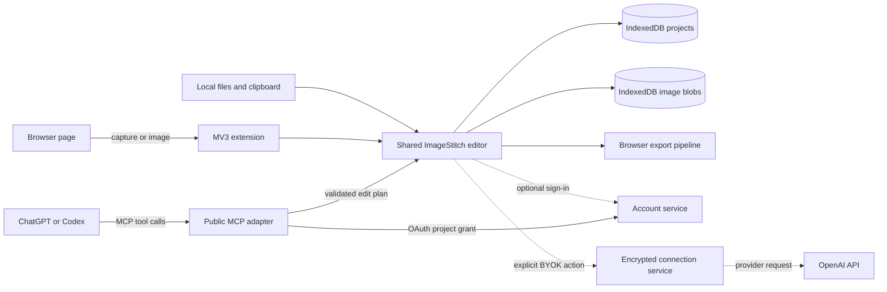
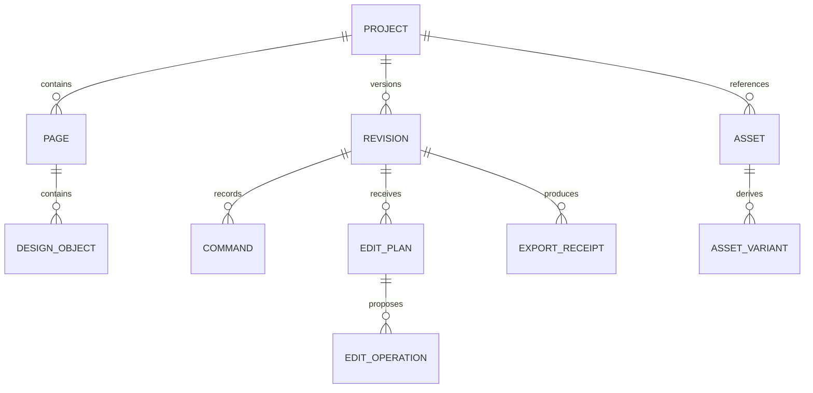

# ImageStitch architecture

## Requirements summary

ImageStitch is a local-first browser application and MV3 extension for image
composition and photo editing. It must remain useful offline, preserve source
assets locally, support deterministic export, and accept constrained AI edit
plans from several interchangeable providers.

Initial scale is one creator and one device at a time. The architecture favors a
modular client over microservices. Optional cloud modules may be introduced only
for synchronization, model connections, or workloads browsers cannot perform.

## System diagram

## Module boundaries

| Module | Responsibility | Owns data | Exposes |
| --- | --- | --- | --- |
| Project core | Manifest, migrations, commands, revisions | Project records | Typed commands and schemas |
| Canvas adapter | Konva node lifecycle and serialization | No durable data | Render and selection adapter |
| Asset repository | Import, hashes, blobs, thumbnails, relinking | Local asset bytes | Asset references |
| Export pipeline | PNG/JPEG/WebP/SVG/PDF generation and QA | Export receipts | Export jobs |
| Extension shell | Capture, page integration, clipboard handoff | Pending captures | Chrome messages |
| AI plan review | Validation, diff, selective acceptance | Edit plans | Plan review commands |
| MCP adapter | Agent-facing project operations | No project bytes | Versioned MCP tools |
| Account client | Optional sessions, preferences, safe connection receipts | No credentials | Cookie-backed service contract |
| Connection service | Optional BYOK encryption and revocation | Encrypted credentials | Opaque connection IDs |

Only project core commits durable project state. Canvas, AI, extension, and
export modules request typed commands rather than mutating persistence directly.

## Domain model

Identifiers are UUIDs, dates are ISO 8601 UTC, dimensions are positive integer
pixels, transformations use an explicit matrix or decomposed numeric fields,
and every plan binds to an immutable base revision.

## Public contracts

- `imagestitch.project.v1`: engine-independent project state, objects, and
  bounded revision snapshots.
- `imagestitch.bundle.v1`: portable project plus base64-encoded local assets.
- `imagestitch.edit-plan.v1`: rationale-bearing proposed object operations.
- `imagestitch.export-receipt.v1`: source revision, dimensions, MIME type,
  byte size, hash, warnings, and approval time.
- MCP tools will wrap the same commands; they do not receive an unrestricted
  browser, filesystem, or canvas mutation primitive.

## Architecture decisions

### ADR-001: Konva as the initial canvas engine

- **Status:** Accepted.
- **Context:** ImageStitch needs a typed, MIT object canvas with dependable
  transforms, layers, events, filters, and browser/Node rendering options.
- **Decision:** Use Konva as an adapter behind an ImageStitch-owned document
  model. Konva passed the initial Chrome visual alignment check and also powers
  the MIT Filerobot editor. It is not the public project contract.
- **Consequences:** We own serialization, typography behavior, history, and
  migrations. Engine upgrades cannot silently redefine persisted projects.
- **Alternatives:** Fabric has a richer design-document model, but the secure
  7.4 release misaligned rendering and controls in the initial browser proof;
  older versions carried active advisories. miniPaint is broad but monolithic;
  Polotno is commercially licensed.

### ADR-002: one editor build for web and extension

- **Status:** Accepted.
- **Decision:** Package the production web build inside the MV3 extension. The
  extension adds capture and page integration; the editor remains one codebase.
- **Consequences:** Store packages are larger, but behavior and schemas do not
  drift between surfaces.

### ADR-003: local-first modular client

- **Status:** Accepted.
- **Decision:** Projects and assets live in IndexedDB by default, with OPFS kept
  as a future large-asset migration. No account
  or backend is required for normal editing and compatible export.
- **Consequences:** Device loss is possible until users export a project or opt
  into sync. Recovery, quota handling, and portable backups are release gates.

### ADR-004: separate subscription and API connections

- **Status:** Accepted.
- **Decision:** ChatGPT/Codex uses MCP under the user's authenticated client.
  Direct API use uses a separately billed API key held only in an encrypted
  server-side vault or future local companion.
- **Consequences:** The UI must explain the distinction and disclose residency
  before a model receives content.

### ADR-005: non-destructive image edits in the project model

- **Status:** Accepted.
- **Context:** Photo adjustments must survive reload, undo, portable export,
  canvas-engine upgrades, and future AI edit plans without replacing originals.
- **Decision:** Keep original blobs immutable. Store crop rectangles as normalized
  source coordinates and adjustments as bounded typed values on image objects.
  The canvas adapter renders these values with Konva filters and display-sized
  caches. Existing v1 image objects migrate to a full crop and neutral settings;
  the public v1 schema keeps the new fields optional for backward compatibility.
- **Consequences:** Edits remain reversible and engine-independent. Filter caches
  consume browser memory, and centered crop presets are intentionally narrower
  than the future interactive crop tool.
- **Alternatives:** Destructive raster replacement was simpler but would lose
  source quality and editability. Persisting Konva filter JSON would couple the
  public contract to one rendering engine.

### ADR-006: optional account client with explicit preview mode

- **Status:** Accepted.
- **Decision:** Keep normal editing accountless. The public client exposes one
  account/connection interface with a visibly labeled local preview adapter and
  an HTTPS private-service adapter. Production sessions use HTTP-only cookies,
  mutating requests use CSRF receipts, and connection responses contain opaque
  identifiers rather than provider credentials.
- **Consequences:** Account and connection UX can be dogfooded before private
  infrastructure exists. Preview state must never be described as real login,
  sync remains off by default, and extension identity needs a future device-link
  flow rather than broad host permissions.

## Risks and mitigations

| Risk | Impact | Mitigation |
| --- | --- | --- |
| Large images or filter caches exhaust browser memory | High | Display-sized caches, decode limits, proxies, workers, OPFS, export capability checks |
| Konva serialization leaks into contract | High | Adapter and explicit project migrations |
| Extension and web behavior drift | Medium | Package the same production editor build |
| Browser storage eviction or quota | High | Persistence request, quota UI, project backups, recovery tests |
| AI edits corrupt designs | High | Base-revision binding, schema validation, preview, selective apply, undo |
| API key exposure | Critical | Never store in client code; encrypted vault, opaque IDs, revocation |
| Template/font/asset licensing errors | High | Machine-readable attribution inventory and release audit |
