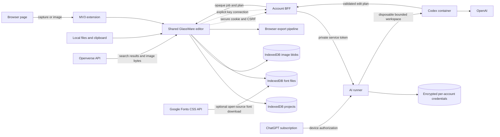
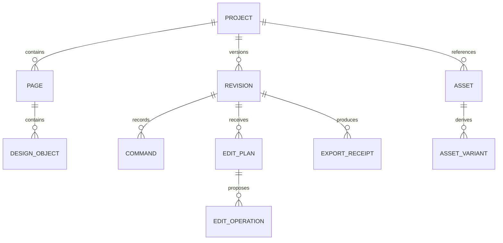

# GlassWare architecture

## Requirements summary

GlassWare is a local-first browser application and MV3 extension for image
composition and photo editing. It must remain useful offline, preserve source
assets locally, support deterministic export, and accept constrained AI edit
plans from several interchangeable providers.

Initial scale is one creator and one device at a time. The architecture favors a
modular client over microservices. Optional cloud modules may be introduced only
for synchronization, model connections, or workloads browsers cannot perform.

## System diagram

## Module boundaries

| Module | Responsibility | Owns data | Exposes |
| --- | --- | --- | --- |
| Project core | Manifest, migrations, commands, revisions | Project records | Typed commands and schemas |
| Canvas adapter | Konva node lifecycle and serialization | No durable data | Render and selection adapter |
| Asset repository | Import, blobs, source receipts, thumbnails, relinking | Local asset bytes and attribution | Asset references |
| Image search adapter | Search and download reusable Openverse media | No durable data | Normalized image candidates |
| Export pipeline | PNG/JPEG/WebP/SVG/PDF generation and QA | Export receipts | Export jobs |
| Extension shell | Capture, page integration, clipboard handoff | Pending captures | Chrome messages |
| AI plan review | Validation, diff, selective acceptance | Edit plans | Plan review commands |
| Account client | Optional sessions, preferences, safe connection receipts | No credentials | Cookie-backed service contract |
| Account BFF | OIDC session, CSRF, private-runner delegation | Signed session cookie | Narrow account, connection, and job API |
| AI runner | Credential vault, device login, job orchestration | Encrypted credentials and bounded job metadata | Private service API only |
| Codex sandbox | One design-planning run with an allowlisted model and reasoning effort | Disposable project manifest and auth cache | Schema-bound edit plan |

Only project core commits durable project state. Canvas, AI, extension, and
export modules request typed commands rather than mutating persistence directly.

## Domain model

Identifiers are UUIDs, dates are ISO 8601 UTC, dimensions are positive integer
pixels, transformations use an explicit matrix or decomposed numeric fields,
and every plan binds to an immutable base revision.

## Public contracts

- `glassware.project.v1`: engine-independent project state, objects, and
  bounded revision snapshots.
- `glassware.bundle.v1`: portable project plus base64-encoded local image and
  used font assets.
- `glassware.edit-plan.v1`: rationale-bearing proposed object operations.
- `glassware.export-receipt.v1`: source revision, dimensions, MIME type,
  byte size, hash, warnings, and approval time.
- Future MCP tools may wrap the same commands; neither current jobs nor future
  tools receive an unrestricted browser, host filesystem, or canvas mutation primitive.

## Architecture decisions

### ADR-001: Konva as the initial canvas engine

- **Status:** Accepted.
- **Context:** GlassWare needs a typed, MIT object canvas with dependable
  transforms, layers, events, filters, and browser/Node rendering options.
- **Decision:** Use Konva as an adapter behind a GlassWare-owned document
  model. Konva passed the initial Chrome visual alignment check and also powers
  the MIT Filerobot editor. It is not the public project contract.
- **Consequences:** We own serialization, typography behavior, history, and
  migrations. Engine upgrades cannot silently redefine persisted projects.
- **Alternatives:** Fabric has a richer design-document model, but the secure
  7.4 release misaligned rendering and controls in the initial browser proof;
  older versions carried active advisories. miniPaint is broad but monolithic;
  Polotno is commercially licensed.

### ADR-002: one editor build for web and extension

- **Status:** Accepted.
- **Decision:** Package the production web build inside the MV3 extension. The
  extension adds capture and page integration; the editor remains one codebase.
- **Consequences:** Store packages are larger, but behavior and schemas do not
  drift between surfaces.

### ADR-003: local-first modular client

- **Status:** Accepted.
- **Decision:** Projects and assets live in IndexedDB by default, with OPFS kept
  as a future large-asset migration. No account
  or backend is required for normal editing and compatible export.
- **Consequences:** Device loss is possible until users export a project or opt
  into sync. Recovery, quota handling, and portable backups are release gates.

### ADR-004: separate subscription and API connections

- **Status:** Accepted.
- **Decision:** ChatGPT subscription access uses the official Codex CLI device
  flow in a private runner. Direct API use uses a separately billed API key.
  Both credential types are encrypted server-side and used only inside
  per-account disposable Codex workspaces.
- **Consequences:** The UI must explain the distinction and disclose residency
  before a model receives content. The runner requires its own deployment,
  vault key, internal token, Docker boundary, revocation, and audit controls.
  Model and reasoning choices are explicit job inputs validated against a
  runner-owned allowlist before Codex starts.

### ADR-005: non-destructive image edits and presentation in the project model

- **Status:** Accepted.
- **Context:** Photo adjustments must survive reload, undo, portable export,
  canvas-engine upgrades, and future AI edit plans without replacing originals.
- **Decision:** Keep original blobs immutable. Store crop rectangles as normalized
  source coordinates, adjustments as bounded typed values, and presentation as
  engine-independent corner, frame, and shadow values on image objects. Canvas
  snapshots also carry a whole-artwork presentation with enablement, outer
  spacing, a solid/gradient/image backdrop, corners, frame, and shadow. Frames
  are engine-independent identifiers for browser, glass, border, and photo
  shells; backdrops retain bounded opacity, blur, and texture values. The editor
  renders that mode as a transformed, clipped composition group while keeping
  every child object's coordinates and editability intact. The
  Screenshot Studio adapter translates the supported `set_border_radius`,
  `set_frame`, and `set_shadow` operation vocabulary into this model. The canvas
  adapter renders these values with Konva filters, composite frame groups, and
  display-sized caches. Screenshot annotations remain ordinary editable shape
  nodes; opaque redaction is intentionally distinct from visual blur. Replacing
  an image updates only its immutable source-asset reference, preserving the
  node's layout and non-destructive settings. Existing v1 image objects migrate to a full crop,
  neutral adjustments, and neutral presentation; the public v1 schema keeps the
  new fields optional for backward compatibility.
- **Consequences:** Image and whole-artwork edits remain reversible and
  engine-independent, and full exports preserve their original dimensions.
  Filter caches
  consume browser memory, and centered crop presets are intentionally narrower
  than the future interactive crop tool.
- **Alternatives:** Destructive raster replacement was simpler but would lose
  source quality and editability. Persisting Konva filter JSON would couple the
  public contract to one rendering engine.

### ADR-006: optional OAuth account service with legacy-device compatibility

- **Status:** Accepted.
- **Decision:** Keep normal editing accountless. The public client preserves old
  device-profile data for migration but creates no new pseudo-accounts. Sign-in
  uses the shared Wiplash realm through an HTTPS private-service adapter; the
  realm owns Google, GitHub, and GitLab provider selection and can reuse an
  existing Wiplash SSO session. Production sessions remain app-specific
  HTTP-only cookies, mutating requests use CSRF receipts, and connection
  responses contain opaque identifiers rather than provider credentials.
- **Consequences:** Old local data remains readable, but device mode does not
  claim cloud authentication and cannot fake sync or provider authorization.
  Extension identity still needs a future
  device-link flow rather than broad host permissions.

### ADR-007: Openverse adapter for openly licensed image search

- **Status:** Accepted.
- **Context:** The Images tool needs useful web search without embedding a
  commercial stock-provider key or pretending arbitrary web images are safe to
  reuse.
- **Decision:** Use the anonymous Openverse API through a typed client adapter.
  Initial results are limited to PDM, CC0, and CC BY entries with mature results
  disabled. Download through Openverse's CORS-enabled image endpoint, save the
  resulting bytes locally, and persist provider, creator, source URL, license,
  and attribution alongside the asset. The MV3 package requests access only to
  `https://api.openverse.org/*`.
- **Consequences:** Search remains optional and normal editing stays local.
  Openverse rate limits and availability affect search, not saved projects.
  Catalog license information can be inaccurate, so the interface preserves a
  source link and asks users to verify the license before publishing.
- **Alternatives:** Arbitrary search-engine scraping was rejected because it
  lacks a dependable reuse-rights contract. Commercial stock APIs were deferred
  because they add credentials, provider terms, and account coupling.

### ADR-008: Local font catalog with optional Google Fonts download

- **Status:** Accepted.
- **Context:** Text needs a useful free catalog and user font uploads without
  making editing, reload recovery, or project sharing depend on a remote font
  stylesheet.
- **Decision:** Present a curated catalog of open-source Google Fonts and fetch
  a selected family through the public CSS API, then store the returned font
  bytes in IndexedDB and register them through `FontFace`. WOFF, WOFF2, TTF, and
  OTF uploads use the same store. Portable bundles embed only font families used
  by that project. Google catalog metadata is curated in source so GlassWare
  does not require a Google Fonts Developer API key.
- **Consequences:** Installed fonts work offline after first download and travel
  with portable projects. Google download requires narrowly scoped extension
  host access to `fonts.googleapis.com` and `fonts.gstatic.com`. User-supplied
  font licenses cannot be inferred, so the interface preserves that warning.

## Risks and mitigations

| Risk | Impact | Mitigation |
| --- | --- | --- |
| Large images or filter caches exhaust browser memory | High | Display-sized caches, decode limits, proxies, workers, OPFS, export capability checks |
| Konva serialization leaks into contract | High | Adapter and explicit project migrations |
| Extension and web behavior drift | Medium | Package the same production editor build |
| Browser storage eviction or quota | High | Persistence request, quota UI, project backups, recovery tests |
| AI edits corrupt designs | High | Base-revision binding, schema validation, preview, selective apply, undo |
| API key or ChatGPT token exposure | Critical | Ephemeral browser input, device auth, AES-GCM vault, opaque IDs, redacted logs, revocation |
| Public request gains host access | Critical | BFF has no Docker socket; private runner uses no host project mounts and launches bounded non-root containers |
| Cross-account credential use | Critical | Account-keyed vault contexts, opaque connection IDs, server-derived account identity |
| Template/font/asset licensing errors | High | Machine-readable attribution inventory and release audit |
| Search catalog has stale or inaccurate license data | High | Restrictive default filters, durable source receipt, visible verification link |
